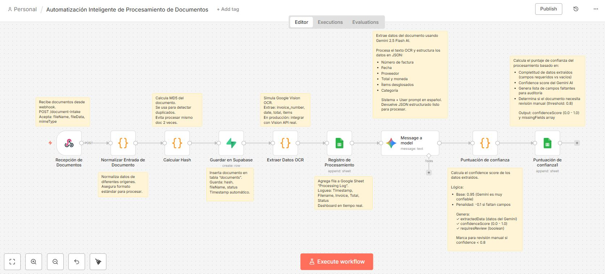
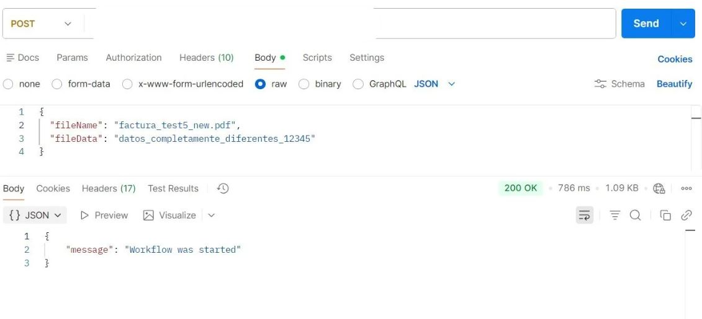
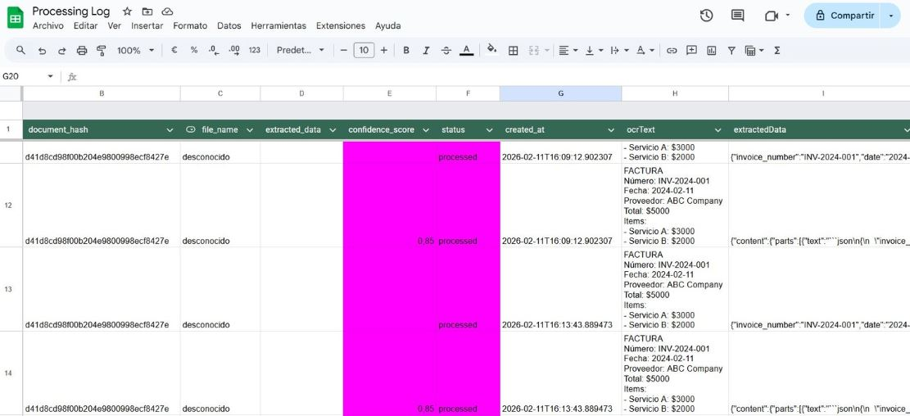

# 🤖 Procesador de Documentos con IA

Pipeline automatizado para procesar documentos (facturas, recibos) usando Gemini AI, n8n, Supabase y Google Sheets.

## 🎯 Características
- ✅ Extracción automática de datos con Gemini 2.5 Flash
- ✅ Validación con confidence scoring
- ✅ Almacenamiento en Supabase

## 🛠️ Tech Stack
- **n8n** - Orquestación de workflows
- **Gemini AI** - Procesamiento de documentos
- **Supabase** - Base de datos
- **Google Sheets** - Dashboard y logging
- **JavaScript** - Lógica de negocio

## 📊 Arquitectura del Workflow

 

 

 

## 🚀 Resultados
- ⚡ Procesa documentos en segundos
- 🎯 % de precisión promedio